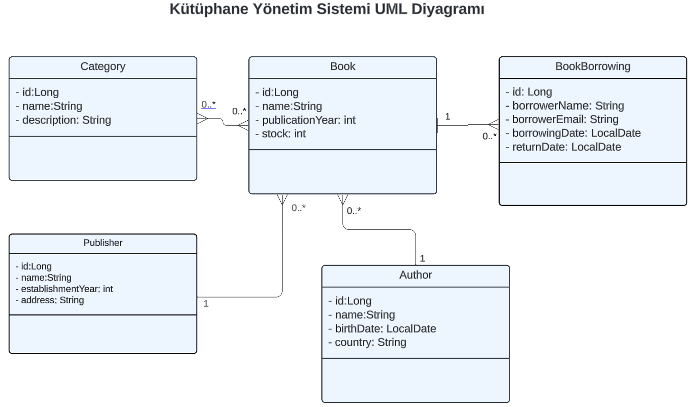

# Library Management System

Welcome to the **Library Management System**! This project is a full-stack application that allows users to manage books, authors, publishers, and borrowing transactions through a REST API.

## 📌 Features

- **CRUD Operations**: Add, update, delete, and view books, authors, publishers, and categories.
- **REST API**: All data transactions are handled using a structured API.
- **Frontend Technologies**: React.js, Material UI, React Router v5, Axios.
- **Backend Technologies**: Spring Boot (or relevant backend technology used).

## 🚀 Live Demo

[Click here to access the live demo](https://glittering-fox-e7f527.netlify.app) 

## 🛠 Technologies Used

### Frontend:
- React.js
- Material UI
- React Router v5
- Axios

### Backend:
- Spring Boot (or specify your backend stack)
- REST API
- Database (MySQL, PostgreSQL, etc.)

## 📌 API Endpoints

Below is a list of available REST API endpoints.

### 📖 Author Endpoints

| Endpoint | HTTP Method | Description |
|----------|------------|-------------|
| `/api/v1/authors/{id}` | GET | Get author by ID |
| `/api/v1/authors/{id}` | PUT | Update author by ID |
| `/api/v1/authors/{id}` | DELETE | Delete author by ID |
| `/api/v1/authors` | GET | Get all authors |
| `/api/v1/authors` | POST | Add a new author |

### 🏢 Publisher Endpoints

| Endpoint | HTTP Method | Description |
|----------|------------|-------------|
| `/api/v1/publishers/{id}` | GET | Get publisher by ID |
| `/api/v1/publisher/{id}` | PUT | Update publisher by ID |
| `/api/v1/publisher/{id}` | DELETE | Delete publisher by ID |
| `/api/v1/publisher` | GET | Get all publishers |
| `/api/v1/publisher` | POST | Add a new publisher |

### 📂 Category Endpoints

| Endpoint | HTTP Method | Description |
|----------|------------|-------------|
| `/api/v1/categories/{id}` | GET | Get category by ID |
| `/api/v1/categories/{id}` | PUT | Update category by ID |
| `/api/v1/categories/{id}` | DELETE | Delete category by ID |
| `/api/v1/categories` | GET | Get all categories |
| `/api/v1/categories` | POST | Add a new category |

### 📚 Book Endpoints

| Endpoint | HTTP Method | Description |
|----------|------------|-------------|
| `/api/v1/books/{id}` | GET | Get book by ID |
| `/api/v1/books/{id}` | PUT | Update book by ID |
| `/api/v1/books/{id}` | DELETE | Delete book by ID |
| `/api/v1/books` | GET | Get all books |
| `/api/v1/books` | POST | Add a new book |

### 🔄 Book Borrowing Endpoints

| Endpoint | HTTP Method | Description |
|----------|------------|-------------|
| `/api/v1/borrows/{id}` | GET | Get borrowing record by ID |
| `/api/v1/borrows/{id}` | PUT | Update borrowing record by ID |
| `/api/v1/borrows/{id}` | DELETE | Delete borrowing record by ID |
| `/api/v1/borrows` | GET | Get all borrowing records |
| `/api/v1/borrows` | POST | Add a new borrowing record |

## 🖥 UML Diagram



## ⚙️ Installation & Setup

1. Clone the repository:
   ```sh
   git clone https://github.com/your-username/library-management-system.git
   ```
2. Navigate to the project directory:
   ```sh
   cd library-management-system
   ```
3. Install dependencies:
   ```sh
   npm install
   ```
4. Start the development server:
   ```sh
   npm start
   ```
5. Run the backend (Spring Boot or your backend setup).

## 📄 License

This project is licensed under the MIT License - see the [LICENSE](LICENSE) file for details.

---

Feel free to update the links and placeholders with your actual project details! 🚀

